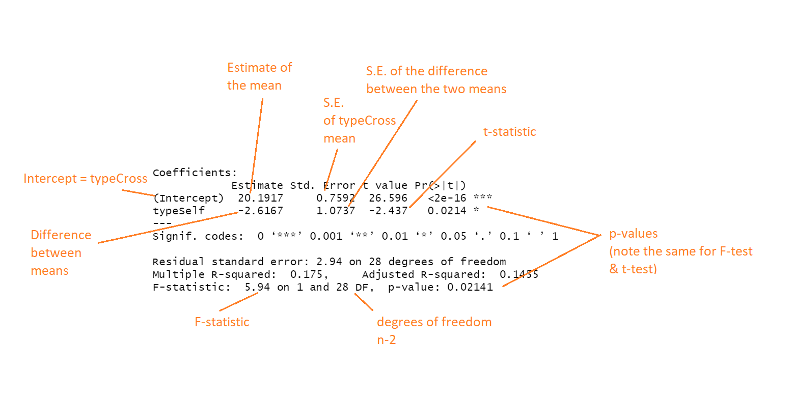

```{r setup, include=FALSE}
knitr::opts_chunk$set(echo = TRUE)
library(tidyverse)
library(skimr)
library(rstatix)
```

# Introductory Statistics

This data is from *The effects of cross and self fertilisation in the vegetable kingdom* published in 1876 by one Charles Darwin. 

Chaz described how he produced seeds of maize (*Zea mays*) that were fertilised with pollen from the same individual or from a different plant. The height of the seedlings that were produced from these were then measured as a proxy for their evolutionary fitness. 

## TASK write a null hypothesis for this experiment - you will test against this

## TASK - Read in the data and check it

```{r, warning=FALSE, message=FALSE}
darwin <- read_csv("Data/darwin.csv")

```

**Checklist**

- Visually inspect the data table
- What data type are you variables in?
- Any errors in data inputting?
- Is there any missing data?
- Is the data in a tidy format?

</details>

```{r, eval=FALSE}
skim(darwin)

## We could also use base R functions
#head(darwin)
#nrow(darwin)
#str(darwin)
# unique(darwin$pot) inspect number of levels for the factor variables
#is.na(darwin)


```

<details><summary>**Checklist answers**</summary>

- There are four columns (pot, pair, type and height), with 30 rows of data. 

- Height is a number variable, while pot, pair and type are all factorial. 

- There don't appear to be any typos - most obvious if there were unexpected extra levels in the factors - although checking for typos in a continuous measure such as height is more easily done with a data visual

- No missing data values

- The data is NOT in a tidy format, each row needs to be a unique observation and each column a unique variable, whereas here there are two plants per row

```{r}
darwin <- darwin %>% 
  pivot_longer(cols=c("Self":"Cross"), 
               names_to="type", 
               values_to="height")
```

 
Check out the height distributions 
```{r}
darwin %>% 
  ggplot(aes(x=height))+geom_histogram()


## a histogram shows the distributions of raw counts, but remember a density plot would show distributions as a Proportion of each groups total.

```

- A quick histogram does *not* indicate we have any outliers. But we haven't separated any sub-groups yet.

</details>


A good place to start would be a very basic plot that makes sense in terms of the hypothesis we are testing. 

## TASK Make a ggplot dotplot of the height of Darwin's maize plants plotted as a function of the cross and self-pollinated treatments. 

Check your code here:

```{r}
darwin %>% 
  ggplot(aes(x=type, 
             y=height))+
  geom_jitter(width=0.1, 
              pch=21, 
              aes(fill=type))+
  theme_classic()

```

This figure suggests that the mean height may be greater for crossed plants than inbred plants. But how confident can we be in this apparent signal?

<details><summary>**Q. Why might inbred plants be smaller than outbred plants?**</summary>

When organisms inbreed it can lead to increased homozygosity. As a result expression of deleterious recessive phenotypes are more likely

</details>

The variability within each group *looks* roughly similar, although there *are* two outbred plants with a height of 12, the two smallest plants across the entire dataset. 

But this is typical of lots of datasets, these negative outliers could be due to attack by pest or disease, physical damage to the plant or even an incorrect measurement at the time of recording. 
It is difficult to say anything really specific as the difference between these groups is not spectacular (and there is plenty of overlap) and then there are these troublesome outliers. 

We need a method to quantify the **signal-to-noise ratio**. Generally speaking the larger the difference we observe relative to the variability *within* a group the more confident we can be in observed differences. But how confident can we be that we are not fooled by a false positive? 


# Linear models

## Fitting an intercept

We are going to use the `lm()` function from base r to perform a linear model analysis. 

We will start our introduction to the `lm()` function to estimate the total mean of our plant heights

```{r, class.source = "fold-show"}
model1 <- lm(height~1, data=darwin)
model1
```

The arguments of the `lm()` function specify that we want to analyse a **response** variable `height` as a function of `(~)` an independent variable. 

In R when we supply `~1` we specify that we do not have an independent variable we simply want to estimate the total mean.

Recall that the slope of a line is $y = mx + c$ - this is the equivalent of setting the line equation to $y = c$ we can see this in action if we use the function `geom_abline` and set an intercept with no slope.

```{r}
darwin %>% 
  ggplot(aes(x=type, 
             y=height))+
  geom_jitter(width=0.1, 
              pch=21, 
              aes(fill=type))+
  theme_classic()+
  geom_abline(intercept=18.88, 
              slope=0, 
              linetype="dashed")

```
**TASK** Let's quickly check that the intercept has accurately estimated the mean, use the `summarise` function to do this

```{r, eval=FALSE,  class.source = "fold-hide"}
darwin %>% 
  summarise(mean=mean(height))

```

## Comparing two groups

Ok so now we have some insight into the `lm()` function, but what we *really* want is a linear model that analyses a dependent variable (height) as a function of a categorical independent variable (type of pollination). We can create a new linear model object for this called `model2` 

## TASK replace `~1` with the name of the independent variable `type`

```{r}
model2 <- lm(height~type, data=darwin)
model2
```
The linear model makes several assumptions about our data, and as with all statistical tests if these are badly contravened then our analysis may not be trustworthy. We will visit these later. 

For now let's take a look at our output. The model formula now actually contains the slope of the line produced by type as well as the intercept indicated by 1 (try it for yourself - R will treat height~1+type & height~type in exactly the same way)

The important distinction is that now the intercept is no longer the total mean of our plants (this was 18.88 now 20.192). 

<details><summary>**Q. So what does the intercept represent now?**</summary>

We can use a process of elimination here. The label of the other number is TypeSelf, since this type has only two levels and typeCross is absent this must be represented by the Intercept.

Confirm this with `group_by()` and `summarise()`

```{r, echo=FALSE}
darwin %>% 
  group_by(type) %>% 
  summarise(mean=mean(height))

```
</details>


<details><summary>**Q. What does -2.617 represent in the column typeSelf?**</summary>

A common mistake would be to think that this value is the height of the selfed plants. However, on closer inspection this is not the case as this would mean plants have a negative height when selfed!

Instead it shows the **difference** between the mean height of selfed plants and the Intercept. 

```{r}
20.19167-17.575
```

So in this case the Intercept refers to the mean height of the *crossed* plants and the second column is the **difference** in the mean height of the two groups (crossed and selfed). This might seem a bit odd until we think about the nature of a linear model. 

The **slope** and **intercept** define the **linear** relationship between the means of these two groups. And this is represented in our simple line equation $\begin{aligned}\operatorname{height} &= 20.19 -2.62(\operatorname{type}_{\operatorname{Self}})\end{aligned}$

I have written out the code manually to re-create this on a graph

```{r}
darwin %>% 
  ggplot(aes(x=type, 
             y=height))+
   geom_jitter(width=0.1, 
              pch=21, 
              aes(fill=type))+
  theme_classic()+
  geom_segment(aes(x=1, xend=2, y=20.192, yend=20.192-2.617), linetype="dashed")+
  stat_summary(fun.y=mean, geom="crossbar", width=0.2)
  
 
```

Note that this time the overall mean is not calculated as we gave R the instruction that there were multiple groups/populations rather than a single one. 

</details>

## Why is my intercept set to typeCross?

This is totally arbitrary, and R will simply set the order levels according to alphabetical order.
You should be familiar with this from working on ggplot2, and the order that groups will be set across the x-axis and down the legend. 
Luckily you can set the factor levels and therefore the intercept to whichever group makes the most sense for your analysis.

```{r}
darwin_relevel <- darwin %>% 
  mutate(type=factor(type, 
                     levels=c("Self",
                              "Cross")))

lm(height~type, data=darwin_relevel)
```

## But where is my p-value????

Hold on! We are getting there - but as data scientists I want you to have a deeper understanding of the linear model and its outputs. 

We will now use the function`summary()` There is a **lot** of information here - so we will spend some time breaking it down in small chunks! 

```{r, eval=FALSE}
summary(model2)
```

```{r model, echo=FALSE}

```


- **Intercept**

The mean value of one of the groups (usually which ever cam first alphabetically)

- **Estimate**

The value of the intercept, and the difference between other treatments and the intercept

- **Standard Error**

Standard error of the mean for the intercept *and* Standard error of the *difference* between the means

- **degrees of freedom**

The number of values which are free to move while the mean stays the same. In essence it is n-the freedoms required for a particular test and is required to calculate probability from the test-statistic

- **Test statistics**

  - F - the signal-to-noise ratio or Sum of squares/sum of square errors
  - t-tests are carried out for *each* independent variable in the ANOVA - here you can see that there is only one variable and the p-value from the t-test and the F-test are the same. For simplicity $F = t^2$. 

- **p-values**

The probability of observing this signal-to-noise ratio at this sample size *if the null hypothesis were true*


# ANOVA table

When you perform a linear model and the independent variable is categorical e.g. a factor. This is **EXACTLY** the same as running an ANOVA

ANOVAS are just a special case of linear model let's double check this ourselves by calling an ANOVA directly. 
For this we will use the function `anova_test()` which is part of {rstatix}. Compare this to the bottom row of the `summary()` output

```{r, warning=FALSE, message=FALSE}
anova_test(height~type, data=darwin)

```

<details><summary>**Q. What do you think is the biggest advantage to our model summary table compare to the ANOVA table?**</summary>

There is a LOT less information in our ANOVA table

The ANOVA table only contains information about the statistical analysis, whereas our model summary also contained direct information about the biology of the plants (their height) and the direction of the relationship between them (selfed plants are smaller than crossed plants)

</details>

# Null hypothesis testing

so our linear model used the difference *between* treatments and the variation *within* groups to calculate a signal-to-noise ratio *F* = 5.9 and we have calculated a *P-*value which says there is only a 2% chance of having data of this size that would produce a signal-to-noise ratio of this magnitude (or larger) if there was actually no effect of pollination type.

We can replicate this very easily with the function `pf()

Our probability of observing this signal-to-noise ratio with this sample size is
```{r}
pf(q=5.9395, df1=1, df2=28, lower.tail=FALSE)
```
This is why it is **vital** that when you report results, that you always report the test-statistic (here *F*), degrees of freedom (df) and *P-*value together
Your significance or probability value can only be calculated/checked when we have the sample size and signal-to-noise ratio. 

<details><summary>**Q. What do you think would happen to *P* if our signal-to-noise stayed the same but our sample size went up/down? What if our sample size stayed the same but the signal-to-noise changed? Hint- use the code above to test out your theory**</summary>

- If our sample size goes up then our *P-*value will fall e.g. the signal-to-noise is the same, but our statistical confidence increases because we have sampled more plants e.g. for a sample size of 100 then *F*~1,98~ = 5.94, *P* = `r round(pf(q=5.9395, df1=1, df2=98, lower.tail=FALSE), 2)`

- If our sample size stayed the same but our signal-to-noise ratio *fell* e.g. *F*~1,98~ = 3.1, *P* = `r pf(q=3.1, df1=1, df2=28, lower.tail=FALSE)`

</details>


In this instance we can say that *if there was no treatment effect* and we ran Darwin's experiment many times over we would expect 2% of the experiments to produce a false positive *of this size*

In most areas of biology we take *P =* 0.05 or less as our cut-off point at which we declare a result to be statistically significant. This is an arbitrary threshold and hopefully you are starting to see that the sample size, signal-to-noise ratio and absoluate *P-*value are much more informative for determining our confidence in whether we can make an inference from an observation.

<details><summary>**Q. What does this mean for our Null Hypothesis?**</summary>

We can reject a null hypothesis that there is no difference between breeding types and plant height, in our example the analysis supports the hypothesis that inbreeding is detrimental to fitness (although the effect is not that large, both treatments have outliers, and the result is not very far away from the conventional significance threshold of 0.05). 

Hypothesis testing is good from framing your objectivity, but no-one writes up a scientific paper like this, in the last section we will have a go at a potential write-up


</details>

## Write-up

**TASK** For this last section, imagine you are writing up this analysis as a result for a lab report. In one sentence write-up your observation and the analysis result which supports it. **After** you have had a go, check your write-up against mine

<details><summary>**Check here for my attempt**</summary>

The cross-pollinated plants were on average significantly taller (20.2 inches) than the self pollinated plants (17.5 inches) *F*~1,28~= 5.94, *P* = 0.02. 

I could include more detail here, such as the overall variation in the heights of the maize plants. and in later sessions we will look at how to present estimates and confidence intervals. But the above would be a perfectly acceptable write-up in most circumstances.


# END

That's all for now, we will build on our use of linear models next time as we look at continuous variables and regression
